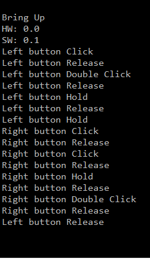

Tiva C TM4C123G LaunchPad Bringup
=================================

This bringup project shows you how to start the board an **C++** project

**Feature**

- _SystemControl_ sets up the system clock and _SysTick_ interrupt which acts as your system heartbeat
- _InterruptHandler_ provides interruption handlers
- _LedIndicator_ blinks an on-board LED to signal heartbeat
- _Logger_ configs the UART0 port which connects to PC via virtual COM port, and provides _printf()_ function
- _Button_ detects _click_, _doubleClick_, _hold_, _release_ events of an input button
- _UserInput_ shows you how to add and handle on-board SW events

**System Structure**

This bringup project use _SysTick_ interrupt as the main task which periodically check buttons states and drives LED.
It also be used to refresh LCD, read inputs, send data. You can add conditions before starting any action in SysTick routine.

In case you set SysTick to a higher frequency (increase _SYSTICK_PER_SECOND_), you should move "slow tasks" to an different timer routine or main loop. This project just shows you how to schedule a task using a simple timer.

**Hardware**

- [Texas Instruments Tiva C Series TM4C123G LaunchPad](http://www.ti.com/tool/ek-tm4c123gxl)
- USB Cable, of course

**Software**

- Install [TI's Code Composer Studio](http://www.ti.com/tool/ccstudio)
- Install [TivaWare for C Series](http://www.ti.com/tool/sw-tm4c)
- Include your Tivaware folder into project, you can use the macro **TI_TIVAWARE_ROOT** in _vars.ini_
- Change the heap size as you want
- To use _ROM_function()_ you must define part number of this kit __TARGET_IS_TM4C123_RB1__
- You can flash to the board via CCS or TI's [LM Flash Programmer](http://www.ti.com/tool/lmflashprogrammer)

**Licensing**

The MIT License applies to this software and its supporting documentation:
