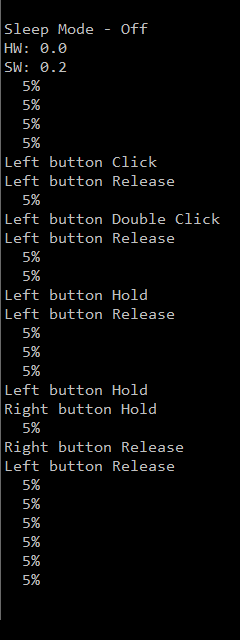
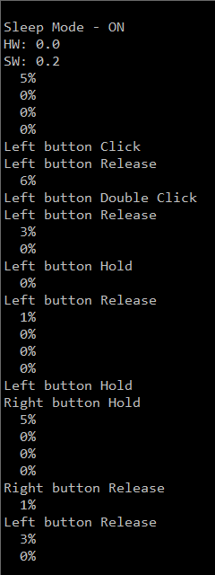

Tiva C TM4C123G LaunchPad Sleep Mode
====================================

This sleep mode project shows you how to put the processor into sleep mode

In the [*BringUp*](../1_BringUp) project, main loop calls `WaitForInterrupt();` to enter sleep mode.
Does it actually do what you want?

This project includes `CpuUsage` module to monitor the number of clock cycles in which CPU actually does something.
Between _SYSTICK_ cycle, CPU only uses some of its clock cycle to do its jobs.
_TIMER2_ will only count those clock cycle when CPU is working.

**Measurement**

**SLEEP MODE OFF**

> In the default _BringUp_ project, CPU is running at 5%

**SLEEP MODE ON**

>Turn on definition of `USE_SLEEP_MODE` in _BuildConfig.h_.
This definition will enable:
- Activate clock on peripherals even CPU goes sleeping
- Enable peripherals to operate when CPU is in sleep
Now, CPU runs at 0%, and goes up when buttons are pressed.
Because it is in sleep, some extra clock cycles are needed to exit sleep mode, which make CPU Usage could peak at 6% or more.

**Hardware**

- [Texas Instruments Tiva C Series TM4C123G LaunchPad](http://www.ti.com/tool/ek-tm4c123gxl)
- USB Cable, of course

**Software**

- Install [TI's Code Composer Studio](http://www.ti.com/tool/ccstudio)
- Install [TivaWare for C Series](http://www.ti.com/tool/sw-tm4c)
- Include your Tivaware folder into project, you can use the macro **TI_TIVAWARE_ROOT** in _vars.ini_
- Change the heap size as you want
- To use _ROM_function()_ you must define part number of this kit __TARGET_IS_TM4C123_RB1__
- You can flash to the board via CCS or TI's [LM Flash Programmer](http://www.ti.com/tool/lmflashprogrammer)

**Licensing**

The MIT License applies to this software and its supporting documentation:
