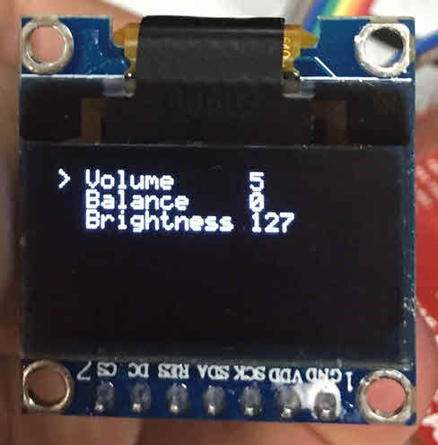

Tiva C TM4C123G LaunchPad Display Menu
======================================

This project shows you how to control `Nokia 5110 LCD` or `SH1106 OLED` to display a menu.
- Display is connected to SSI0 on TM4C123, running at 4Mbps
- Menu is designed to add MenuItem easily
- Each MenuItem has its own property which can be one of Label, Number, Switch or your Property inherited class
- User input will send actions to MainMenu to select up/down, enter/exit menu, change value of selected item, with single click, double click, and long press
- Screen is only updated when user interacts with buttons, this keesp CPU idle when not used
- You will decide to allow a peripheral runs when CPU sleeps

LCD

OLED 128x64

**Hardware**

- [Texas Instruments Tiva C Series TM4C123G LaunchPad](http://www.ti.com/tool/ek-tm4c123gxl)
- Nokia 5110 LCD
- USB Cable, of course

**Software**

- Install [TI's Code Composer Studio](http://www.ti.com/tool/ccstudio)
- Install [TivaWare for C Series](http://www.ti.com/tool/sw-tm4c)
- Include your Tivaware folder into project, you can use the macro **TI_TIVAWARE_ROOT** in _vars.ini_
- Change the heap size as you want
- To use _ROM_function()_ you must define part number of this kit __TARGET_IS_TM4C123_RB1__
- You can flash to the board via CCS or TI's [LM Flash Programmer](http://www.ti.com/tool/lmflashprogrammer)

**Licensing**

The MIT License applies to this software and its supporting documentation:
