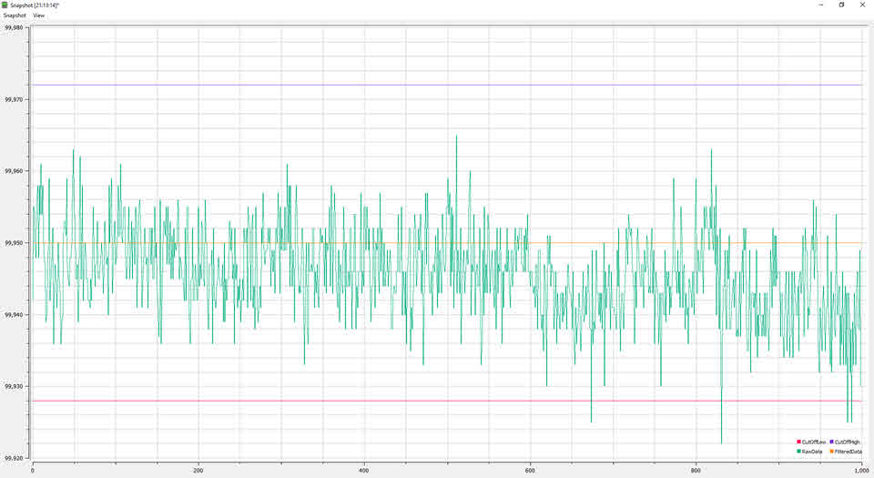
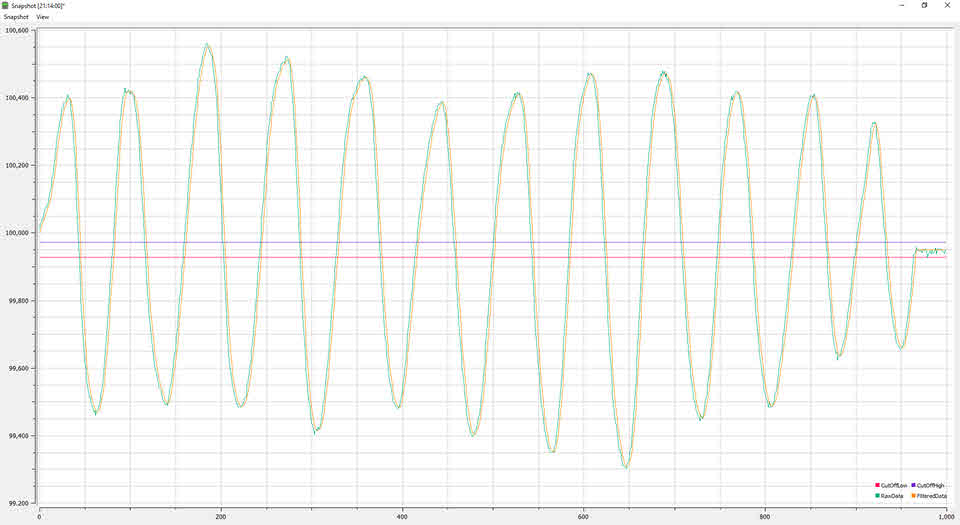
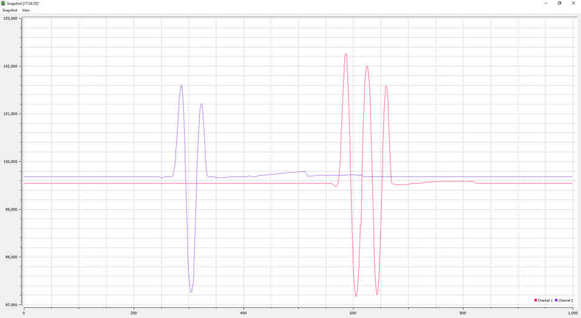
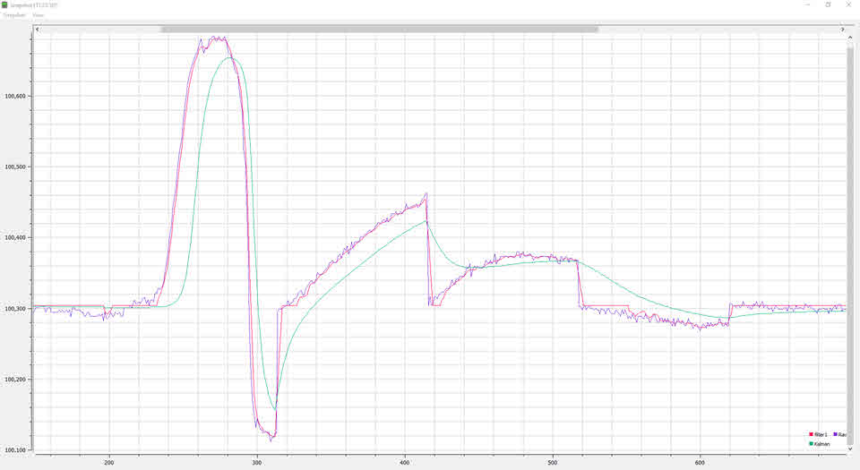
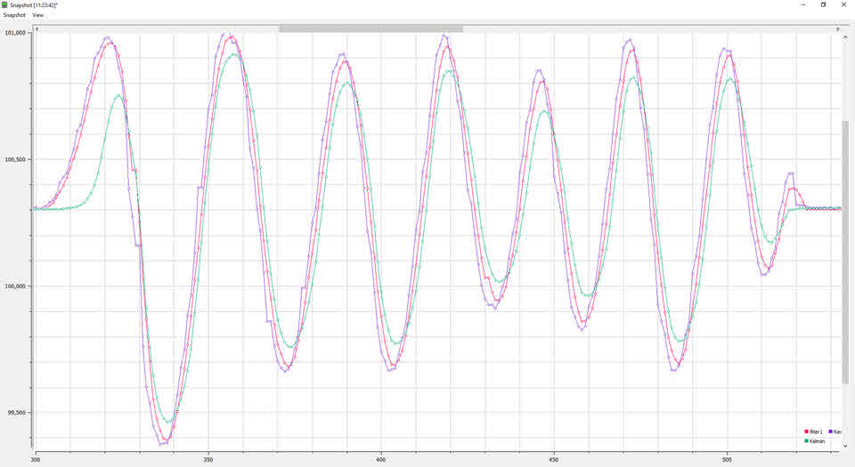
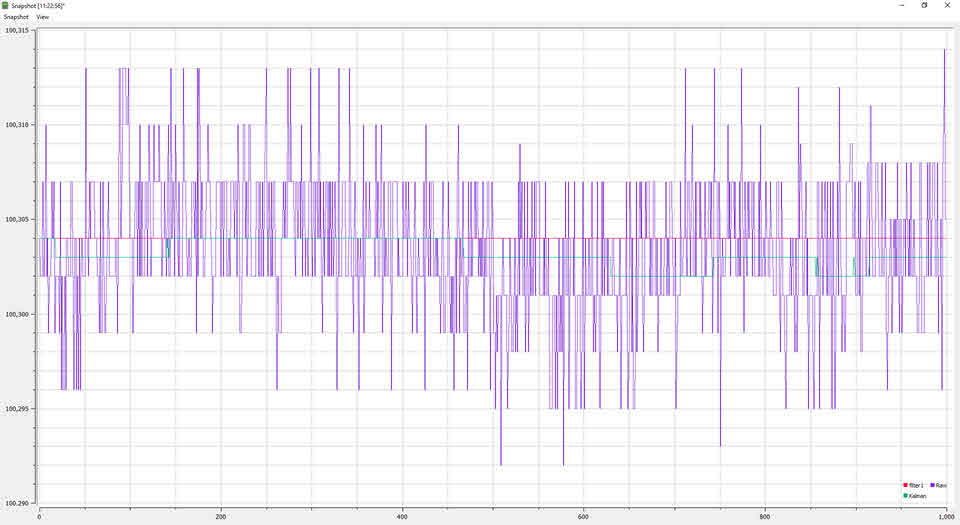

Tiva C TM4C123G LaunchPad Sensors
=================================

This project shows you how to use `I2C` to communicate with `BMP180/ BMP280 Barometric Pressure Sensors`. This project supports multiple I2C slave devices. The data from sersor is filtered to remove noise and glitch. This is an option to use my filter or a simple Kalman filter.

The filtered pressure value is then used to make musical notes, via on-broard synthesizer with DAC or via PC's MIDI synthesizer. See the demo video:

<video controls="controls" autoplay="autoplay" width="200px">
  <source src="../pressure_to_sound.mp4" type="video/mp4" />
</video>

**Hardware**

- [Texas Instruments Tiva C Series TM4C123G LaunchPad](http://www.ti.com/tool/ek-tm4c123gxl)
- BMP180 or BMP280 barometric pressure sensors
- USB Cable, of course

**Software**

- Install [TI's Code Composer Studio](http://www.ti.com/tool/ccstudio)
- Install [TivaWare for C Series](http://www.ti.com/tool/sw-tm4c)
- Include your Tivaware folder into project, you can use the macro **TI_TIVAWARE_ROOT** in _vars.ini_
- Change the heap size as you want
- To use _ROM_function()_ you must define part number of this kit __TARGET_IS_TM4C123_RB1__
- You can flash to the board via CCS or TI's [LM Flash Programmer](http://www.ti.com/tool/lmflashprogrammer)

**Licensing**

The MIT License applies to this software and its supporting documentation:
