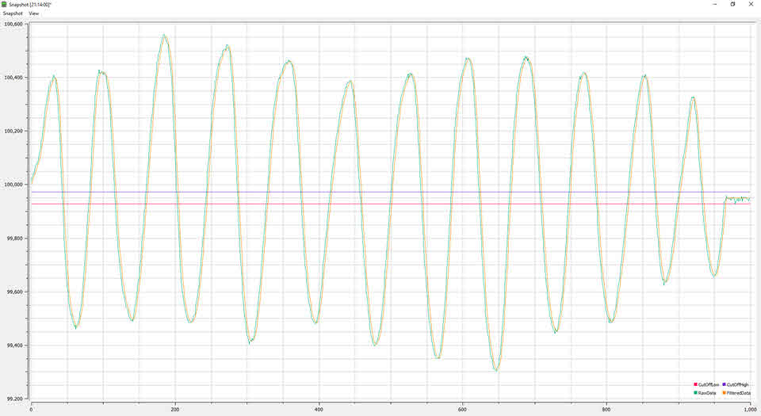
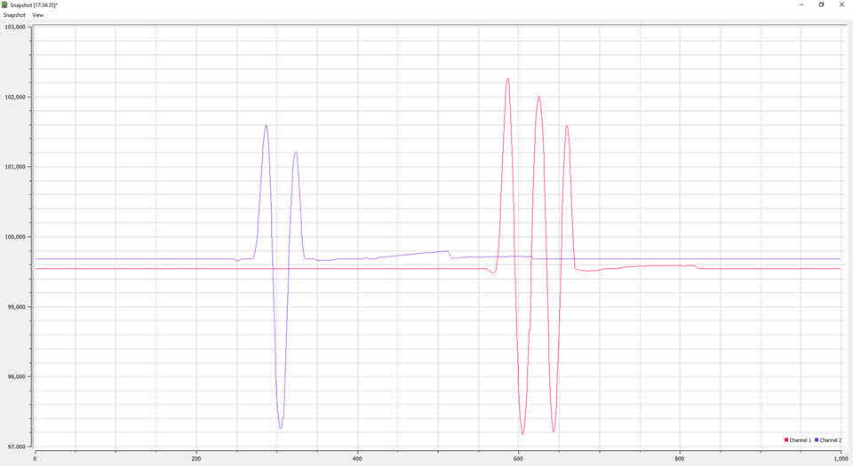

Tiva C TM4C123G LaunchPad
=========================

This is my practice on an ARM Cortex-M4F processor ([Tiva LaunchPad TM4C123G](http://www.ti.com/tool/ek-tm4c123gxl))

Please kindly check sub-folders for more project details:

# [1. Bring Up](./1_BringUp)

This bringup project use _SysTick_ interrupt as the main task which periodically check buttons states and drives LED. It also be used to refresh LCD, read inputs, send data. You can add conditions before starting any action in SysTick routine.

# [2. Sleep Mode](./2_SleepMode)

In the [*BringUp*](./1_BringUp) project, main loop calls `WaitForInterrupt();` to enter sleep mode. Does it actually do what you want?
This project includes `CpuUsage` module to monitor the number of clock cycles in which CPU actually does something. Between _SYSTICK_ cycle, CPU only uses some of its clock cycle to do its jobs. _TIMER2_ will only count those clock cycle when CPU is working.

# [3. Firmware Update](./3_FwUpdate)

Shows you how to switch your board to USB Device Firmware Update mode with on-board ROM bootloader. While pressing and holding 2 buttons, press reset to enter bootloader.

# [4. Boot Loader](./4_BootLoader)
To make your own bootloader, this project requires 2 parts: `BootLoaderUsb` providing USB DFU, `JumpToBootLoader` hooks user input to enter boot loader
In _tm4c123gh6pm.cmd_, you will add _APP_BASE_ and _RAM_BASE_, re-config flash address, _.intvers_ location. 
You have to flash BOOT LOADER first, then flash APPLCATION later using LM Flash Programmer only, don't use CCS flasher, `start address is 0x2800`

# [5. LCD Menu](./5_LcdMenu)

This shows a menu to user with menu item and controllable settings. It's designed to easily add new item, make new property, run on `Nokia 5110` or `SH1106 OLED`. Each MenuItem has its own property which can be one of Label, Number, Switch or your Property inherited class. User input will send actions to MainMenu to select up/down, enter/exit menu, change value of selected item, with single click, double click, and long press. Screen is only updated when user interacts with buttons, this keesp CPU idle when not used.

# [6. DAC and Audio](./6_Audio)

This project uses `MCP4921 12b DAC` to play sound. it also includes `Audio Generator` to make waves. This project uses `uDMA` for faster data transfer. `MCP4921` is connected to SSI1 on TM4C123, running at 44.1kHz x 12b. `uDMA` transfer data from audio buffer to SSI1, in ping-pong mode. You can play a piece of audio, please check _AUDIO_TEST_ definition.

# [7. Sensors](./7_Sensors)

This project connects to multiple `BMP280` sensors on I2C bus and filter received data to make musical note on speaker. You can see the data on graph by enabling `PROBE_SENSOR_DATA` to output data on serial. if `USE_MIDI_UART` is enabled, you can connect UART to any MIDI synthesizer.

